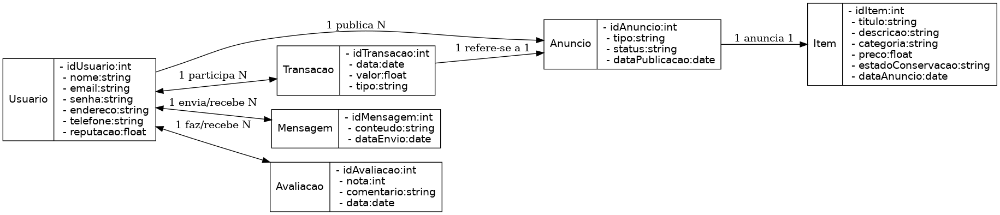

#  Modelo Conceitual – Plataforma de Compra, Venda e Troca de Itens

Este documento apresenta o **Diagrama de Classes de Análise** e a descrição detalhada das principais classes do sistema.

##  Diagrama de Classes de Análise

O diagrama acima representa as principais entidades do sistema, seus atributos e relacionamentos com cardinalidade.

---

##  Descrição das Classes

### 1. Classe `Usuario`
Representa o usuário cadastrado na plataforma, que pode ser comprador, vendedor ou ambos. Armazena informações pessoais, credenciais de acesso e a reputação calculada com base nas avaliações recebidas.

**Atributos:**
- `idUsuario` (int): Identificador único do usuário.
- `nome` (string): Nome completo do usuário.
- `email` (string): Endereço de e-mail para login e contato.
- `senha` (string): Senha de acesso ao sistema.
- `endereco` (string): Endereço físico do usuário.
- `telefone` (string): Número de telefone para contato.
- `reputacao` (float): Pontuação média obtida a partir das avaliações recebidas.

---

### 2. Classe `Item`
Representa o bem ou produto que será anunciado na plataforma, contendo informações de identificação, descrição e valor.

**Atributos:**
- `idItem` (int): Identificador único do item.
- `titulo` (string): Nome ou título do item.
- `descricao` (string): Detalhes descritivos do item.
- `categoria` (string): Categoria à qual o item pertence.
- `preco` (float): Valor proposto para venda ou referência para troca.
- `estadoConservacao` (string): Condição do item (Novo, Usado, etc.).
- `dataAnuncio` (date): Data em que o item foi colocado à venda ou troca.

---

### 3. Classe `Anuncio`
Corresponde ao registro da oferta de um item, seja para venda ou troca, publicada por um usuário na plataforma.

**Atributos:**
- `idAnuncio` (int): Identificador único do anúncio.
- `tipo` (string): Tipo do anúncio (Venda, Troca).
- `status` (string): Situação do anúncio (Ativo, Encerrado, etc.).
- `dataPublicacao` (date): Data em que o anúncio foi publicado.

---

### 4. Classe `Transacao`
Representa uma negociação concretizada na plataforma, podendo ser de compra ou troca, vinculada a um anúncio específico.

**Atributos:**
- `idTransacao` (int): Identificador único da transação.
- `data` (date): Data em que a transação ocorreu.
- `valor` (float): Valor acordado na transação (zero em caso de troca).
- `tipo` (string): Tipo da transação (Venda, Troca).

---

### 5. Classe `Mensagem`
Armazena a comunicação trocada entre usuários dentro da plataforma para negociação ou esclarecimentos.

**Atributos:**
- `idMensagem` (int): Identificador único da mensagem.
- `conteudo` (string): Texto da mensagem enviada.
- `dataEnvio` (date): Data e hora do envio da mensagem.

---

### 6. Classe `Avaliacao`
Registra a opinião de um usuário sobre outro após a conclusão de uma transação, contribuindo para a reputação.

**Atributos:**
- `idAvaliacao` (int): Identificador único da avaliação.
- `nota` (int): Pontuação atribuída (0 a 5).
- `comentario` (string): Texto opcional com observações sobre a transação.
- `data` (date): Data em que a avaliação foi registrada.

---
